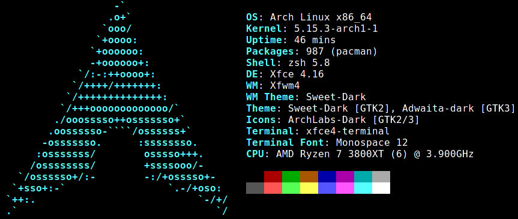

### Hello there! :octocat: :octocat: :octocat:

Those are my arch dotfiles.



      I use Arch XFCE 
       \
        \
            .--.
           |o_o |
           |:_/ |
          //   \ \
         (|     | )
        /'\_   _/`\
        \___)=(___/


# :rocket: Getting started

## Download
```
sudo pacman -Sy git && git clone --depth=1 https://github.com/christiantusset/dotfiles-arch.git ~/Documents/dotfiles-arch && cd ~/Documents/dotfiles-arch
```

## Executing the script
You can install one of them by running the setup executable.
* **[WARNING]**: Support for Arch Linux based systems only (installation via pacman).

### Execution

    bash setup.sh all

### Use

    bash setup.sh <ARG>

where ```<ARG>``` may be:

```
all          - installs all at once: pacman packages, aur packages
pacman       - installs necessary packages from pacman
aur          - installs necessary packages from AUR and external sources
```


# XFCE

## [🧛 SweetDark](https://github.com/EliverLara/Sweet)
- **Theme** →                      [SweetDark](https://www.pling.com/p/1253385/)
- **Icons** →                      [Reversal Blue dark](https://www.pling.com/p/1340791/)
- **Cursor** →                     [Sweet cursors](https://www.gnome-look.org/p/1393084/)
- **Wallpaper** →                  [Material Design]()
- **Window Manager** →             [Sweet Ambar](https://wiki.archlinux.org/index.php/zsh)

## [👨‍💻 Futuristic](https://www.pling.com/p/1352568)
- **Theme** →                      [Pandora Arc [oomox]](https://www.pling.com/p/1352568/)
- **Icons** →                      [Candy Icons](https://www.pling.com/p/1305251/)
- **Cursor** →                     [Fossa Cursors](https://www.pling.com/p/1377483/)
- **Wallpaper** →                  [Ultraviolet 4K]()
- **Window Manager** →             [Pandora glowing theme](https://www.pling.com/p/1396322/)


# Hardware Dependent Software

## Graphics

Usually **one** of the following drivers will work.
Check the [intel graphics](https://wiki.archlinux.org/index.php/Intel_graphics),
[nvidia](https://wiki.archlinux.org/index.php/NVIDIA), and
[nouveau](https://wiki.archlinux.org/index.php/nouveau)
pages on the wiki.

### nvidia

	sudo pacman -Sy nvidia

### amd

	sudo pacman -Sy mesa vulkan-intel

### intel

	sudo pacman -Sy mesa xf86-video-intel

### nouveau

	sudo pacman -Sy xf86-video-nouveau

### ati

    sudo pacman -Sy xf86-video-ati

### vmware

	sudo pacman -Sy open-vm-tools && sudo systemctl enable vmtoolsd && sudo systemctl start vmtoolsd

## Power Management

In general, check out [*Power management* on the Arch wiki](https://wiki.archlinux.org/index.php/Power_management).

For systems with hybrid graphics (with both an integrated GPU and a dedicated
GPU), see [Bumblebee](https://wiki.archlinux.org/index.php/Bumblebee) to save
laptop battery or energy.